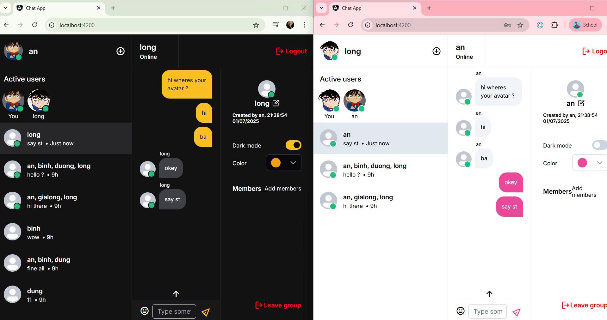

# Real-time Chat Application

A full-stack real-time chat application built with Spring Boot and Angular, featuring WebSocket integration for instant messaging and comprehensive message management.

## 🚀 Features

- **Real-time Messaging**: Instant message delivery using WebSocket technology
- **Chat Rooms**: Create and join multiple chat rooms
- **Unread Message Counter**: Track unseen messages for each user
- **Message Persistence**: All messages stored in database with timestamps

## 🚀 Getting Started

### Prerequisites
- Java 17
- Node.js 20.19.3
- MySQL 8.0.42
- Maven 3.9.6
- Angular 16.2.10
- PrimeNG: 17.18.9

